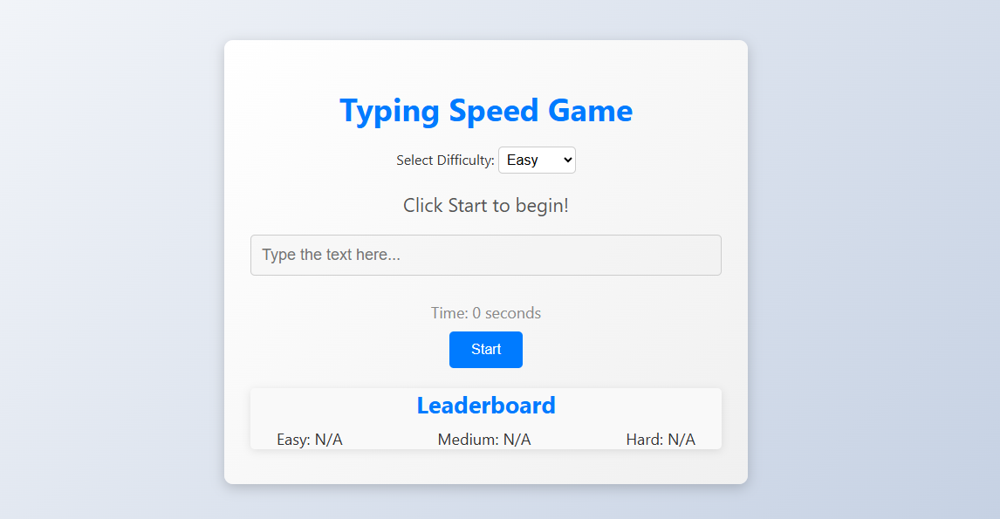

# Typing Speed

## Features

- Measure typing speed in words per minute (WPM)
- Real-time typing accuracy calculation
- Display of typing errors and corrections
- Multiple difficulty levels with varying text lengths
- User-friendly interface with responsive design
- Offline mode for uninterrupted practice



## How to Clone or Use

To clone the repository, use the following command:

```bash
git clone https://github.com/yourusername/typing-speed.git
```

Navigate to the project directory:

```bash
cd typing-speed
```

Install the necessary dependencies:

```bash
npm install
```

Start the application:

```bash
npm start
```

Open your browser and go to <code>http://localhost:3000</code> to use the application.
